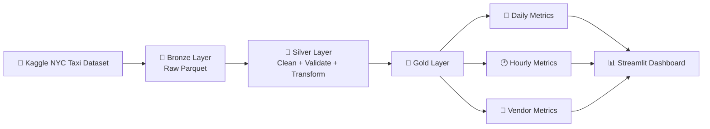
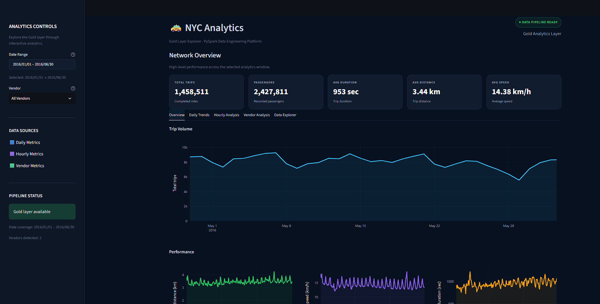

# 🚕 NYC Taxi Data Engineering Pipeline

### Turning real-world taxi trip data into clean, analytics-ready datasets with PySpark

<p align="center">
  
  
  
  
  
</p>

<p align="center">
  <b>Raw CSV → Bronze → Silver → Gold → Dashboard</b>
</p>

---

## 📌 Overview

This project is an end-to-end **batch data engineering pipeline** built using **Python and PySpark**.

The pipeline takes a real-world NYC taxi trip dataset sourced from **Kaggle**, processes it through a layered **Bronze → Silver → Gold** architecture, applies data-quality and business validations, creates analytical metrics, and makes the final results available through an interactive **Streamlit dashboard**.

The project was developed and executed in a **local PySpark environment** on my computer, including the required Python packages and Java runtime.

The main focus was not simply to analyze taxi data, but to build the complete workflow around the data:

```text
Ingest
  ↓
Validate
  ↓
Clean
  ↓
Transform
  ↓
Aggregate
  ↓
Store
  ↓
Visualize
```

---

## 🎯 Why I Built This

I wanted to work with a **real dataset** rather than a small synthetic dataset so that the ETL process would have to deal with realistic data characteristics.

The project gave me an opportunity to work through several practical data engineering problems:

* Defining and enforcing a schema
* Handling missing values
* Validating incoming records
* Applying business rules
* Creating derived features
* Processing data with Spark
* Designing layered datasets
* Writing analytical aggregations
* Persisting data in Parquet
* Testing transformation logic
* Building a dashboard on top of processed data

In short, the project is meant to demonstrate the journey from **raw data to usable analytics**.

---

# 🏗️ Architecture



### The pipeline in simple terms

```text
                    RAW DATA
                       │
                       ▼
              ┌─────────────────┐
              │     BRONZE      │
              │   Raw Parquet   │
              └────────┬────────┘
                       │
                       ▼
              ┌─────────────────┐
              │     SILVER      │
              │                 │
              │  Clean          │
              │  Validate       │
              │  Transform      │
              │  Enrich         │
              └────────┬────────┘
                       │
                       ▼
              ┌─────────────────┐
              │      GOLD       │
              │                 │
              │ Daily Metrics   │
              │ Hourly Metrics  │
              │ Vendor Metrics  │
              └────────┬────────┘
                       │
                       ▼
              ┌─────────────────┐
              │    DASHBOARD    │
              │    Streamlit    │
              └─────────────────┘
```

---

# 🥉 Bronze Layer

The Bronze layer is the first persisted stage of the pipeline.

The raw CSV is loaded into Spark using an explicit schema and written to Parquet.

### Responsibilities

* Read the raw CSV
* Apply the expected schema
* Preserve the ingested records
* Store the data in Parquet format

Output:

```text
data/processed/bronze/
```

The Bronze layer intentionally contains minimal transformation logic.

---

# 🥈 Silver Layer

The Silver layer is where the raw records are cleaned, validated, and enriched.

### Data cleaning

The pipeline removes records that are missing fields required for trip analysis.

### Business validation

Records are checked against rules such as:

* Vendor ID must be positive
* Passenger count must be between 1 and 8
* Trip duration must be greater than 0
* Trip duration cannot exceed 24 hours
* Latitude values must be within valid geographic ranges
* Longitude values must be within valid geographic ranges
* Dropoff must occur after pickup

### Derived metrics

The pipeline creates additional analytical fields:

```text
trip_distance_km
trip_speed_kmh
pickup_date
pickup_hour
pickup_day_of_week
pickup_month
```

Trip distance is calculated using the **Haversine formula**, which provides the great-circle distance between the pickup and drop-off coordinates.

Output:

```text
data/processed/silver/
```

---

# 🥇 Gold Layer

The Gold layer contains the datasets used for analytics and dashboarding.

Instead of repeatedly aggregating the Silver dataset, the pipeline produces purpose-built analytical datasets.

## 📅 Daily Metrics

Aggregated by pickup date.

| Column                  | Description           |
| ----------------------- | --------------------- |
| `pickup_date`           | Date of the trip      |
| `total_trips`           | Total number of trips |
| `total_passengers`      | Total passengers      |
| `avg_trip_duration_sec` | Average trip duration |
| `avg_trip_distance_km`  | Average trip distance |
| `avg_trip_speed_kmh`    | Average trip speed    |

Location:

```text
data/processed/gold/daily_metrics/
```

---

## 🕐 Hourly Metrics

Aggregated by pickup date and pickup hour.

| Column                  | Description           |
| ----------------------- | --------------------- |
| `pickup_date`           | Date of the trip      |
| `pickup_hour`           | Hour of pickup        |
| `total_trips`           | Total number of trips |
| `total_passengers`      | Total passengers      |
| `avg_trip_duration_sec` | Average trip duration |
| `avg_trip_distance_km`  | Average trip distance |
| `avg_trip_speed_kmh`    | Average trip speed    |

Location:

```text
data/processed/gold/hourly_metrics/
```

---

## 🚖 Vendor Metrics

Aggregated by vendor.

| Column                  | Description            |
| ----------------------- | ---------------------- |
| `vendor_id`             | Taxi vendor identifier |
| `total_trips`           | Total number of trips  |
| `total_passengers`      | Total passengers       |
| `avg_trip_duration_sec` | Average trip duration  |
| `avg_trip_distance_km`  | Average trip distance  |
| `avg_trip_speed_kmh`    | Average trip speed     |

Location:

```text
data/processed/gold/vendor_metrics/
```

---

# 🧹 Data Quality

Data quality is treated as part of the pipeline rather than as a separate manual step.

The project contains dedicated data-quality functions for checking:

* Missing required columns
* Null values
* Invalid pickup hours
* Invalid vendor IDs
* Invalid Gold-layer metrics

The transformation layer additionally validates business rules and derived metrics.

### Validation rules

| Field / Metric   | Validation            |
| ---------------- | --------------------- |
| Vendor ID        | Positive and non-null |
| Passenger count  | `1–8`                 |
| Trip duration    | `1 second–24 hours`   |
| Latitude         | `-90 to 90`           |
| Longitude        | `-180 to 180`         |
| Pickup / Dropoff | Dropoff after pickup  |
| Trip distance    | `0–500 km`            |
| Trip speed       | `0–200 km/h`          |

These rules are intended to remove clearly invalid records before they influence downstream analytics.

---

# 📦 Dataset

The raw dataset used for this project was sourced from **Kaggle**.

The dataset follows the NYC Taxi Trip Duration structure, including fields such as:

```text
id
vendor_id
pickup_datetime
dropoff_datetime
passenger_count
pickup_longitude
pickup_latitude
dropoff_longitude
dropoff_latitude
store_and_fwd_flag
trip_duration
```

The dataset is based on NYC taxi trip records and is commonly distributed through Kaggle as the **NYC Taxi Trip Duration** dataset.

### Why Kaggle?

I chose a real dataset because it provides more realistic ETL challenges than manually generated data.

Working with the dataset makes the pipeline deal with:

* Missing values
* Timestamps
* Geographic coordinates
* Different data types
* Invalid records
* Business constraints
* Derived metrics
* Aggregation at different levels

### Dataset availability

The raw dataset is **not committed to this repository**.

After downloading the dataset, place the required CSV file at:

```text
data/raw/train.csv
```

> **Dataset attribution:** The original dataset is hosted on Kaggle. Please refer to the original Kaggle dataset page for its current license and attribution requirements.

👉 [NYC Taxi Trip Duration — Kaggle](https://www.kaggle.com/datasets/yasserh/nyc-taxi-trip-duration)

---

# 💻 Local PySpark Environment

The ETL pipeline was developed and executed in a **local PySpark environment** on my computer.

The complete Spark workflow was tested locally, including:

* Data ingestion
* Bronze-layer creation
* Silver-layer transformation
* Gold-layer aggregation
* Data-quality validation
* Automated tests
* Dashboard data loading

### Environment

| Component      | Version / Purpose         |
| -------------- | ------------------------- |
| Python         | 3.10+                     |
| PySpark        | 4.2.0                     |
| Java / OpenJDK | 17                        |
| Pandas         | 2.3.3                     |
| NumPy          | 2.5.2                     |
| Plotly         | 6.9.0                     |
| Streamlit      | 1.61.1                    |
| Pytest         | Testing framework         |
| Parquet        | Analytical storage format |

The Python package versions are pinned in `requirements.txt`.

The repository also includes `packages.txt` for the Java runtime dependency used by the deployment environment.

### Local execution model

```text
┌─────────────────────────────┐
│       Local Computer        │
│                             │
│  Python                     │
│    │                        │
│    ├── PySpark              │
│    ├── Pandas               │
│    ├── NumPy                │
│    ├── Plotly               │
│    └── Streamlit            │
│                             │
│  Java / OpenJDK 17          │
└──────────────┬──────────────┘
               │
               ▼
       PySpark ETL Pipeline
               │
               ▼
       Bronze → Silver → Gold
               │
               ▼
         Parquet Outputs
               │
               ▼
       Streamlit Dashboard
```

This project does **not** require a separate Spark cluster to run the current implementation.

---

# 🧰 Technology Stack

| Technology              | Role                                     |
| ----------------------- | ---------------------------------------- |
| 🐍 **Python**           | Pipeline and application development     |
| ⚡ **PySpark**           | ETL and distributed DataFrame processing |
| 🗃️ **Parquet**         | Columnar analytical storage              |
| 🐼 **Pandas**           | Dashboard-side data handling             |
| 🔢 **NumPy**            | Numerical operations                     |
| 📊 **Plotly**           | Interactive visualizations               |
| 🎈 **Streamlit**        | Dashboard application                    |
| 🧪 **Pytest**           | Automated testing                        |
| ☕ **Java / OpenJDK 17** | Spark runtime                            |

---

# 📁 Project Structure

The repository has been organized to separate the pipeline code, executable jobs, dashboard, tests, documentation, notebooks, and generated data.

```text
data-engineering-pipeline/
│
├── 📂 dashboard/
│   └── app.py
│
├── 📂 data/
│   └── processed/
│       └── gold/
│           ├── daily_metrics/
│           ├── hourly_metrics/
│           └── vendor_metrics/
│
├── 📂 docs/
│   └── data_dictionary.md
│
├── 📂 jobs/
│   ├── aggregate.py
│   ├── ingest.py
│   ├── pipeline.py
│   ├── transform.py
│   ├── transform_gold.py
│   ├── transform_silver.py
│   ├── verify_bronze.py
│   ├── verify_gold.py
│   └── verify_silver.py
│
├── 📂 notebooks/
│   └── exploration.ipynb
│
├── 📂 src/
│   ├── __init__.py
│   ├── data_quality.py
│   ├── pipeline.py
│   ├── schemas.py
│   ├── spark_session.py
│   └── transformations.py
│
├── 📂 tests/
│   ├── test_data_quality.py
│   ├── test_pipeline.py
│   └── test_transformations.py
│
├── .gitignore
├── packages.txt
├── requirements.txt
└── README.md
```

---

# 🧩 Repository Components

### `src/`

Contains the core reusable pipeline implementation.

* `pipeline.py` — main pipeline orchestration
* `schemas.py` — Spark schema definitions
* `spark_session.py` — Spark session configuration
* `transformations.py` — cleaning and transformation logic
* `data_quality.py` — data-quality checks

### `jobs/`

Contains executable job-oriented scripts for individual pipeline stages and verification.

The directory includes ingestion, transformation, aggregation, and layer-verification jobs.

### `tests/`

Contains automated tests for:

* Data quality
* Transformations
* Pipeline execution

### `notebooks/`

Contains exploratory work used during development and data investigation.

Currently:

```text
notebooks/exploration.ipynb
```

### `docs/`

Contains project documentation.

The repository currently includes:

```text
docs/data_dictionary.md
```

This file is intended to document the dataset and its fields.

### `dashboard/`

Contains the Streamlit analytics application.

---

# 🔍 Exploratory Analysis

Before building the final pipeline, the repository also contains a notebook for exploring the dataset:

```text
notebooks/exploration.ipynb
```

This separates exploratory work from the reusable ETL code.

The notebook can be used to understand the raw data before running the production-style transformation workflow.

---

# 🚀 Getting Started

## Prerequisites

Make sure the following are installed:

* Python 3.10 or newer
* Java / OpenJDK 17
* Git
* pip

The current dependency versions are defined in:

```text
requirements.txt
```

---

## 1. Clone the repository

```bash
git clone https://github.com/mithlessh/data-engineering-pipeline.git
cd data-engineering-pipeline
```

---

## 2. Create a virtual environment

### Windows

```powershell
python -m venv .venv
```

Activate it:

```powershell
.\.venv\Scripts\Activate.ps1
```

### Linux / macOS

```bash
python3 -m venv .venv
source .venv/bin/activate
```

---

## 3. Install Python dependencies

```bash
python -m pip install --upgrade pip
pip install -r requirements.txt
```

---

## 4. Verify Java

```bash
java -version
```

The Spark environment is configured around Java 17.

If Spark cannot find Java, make sure `JAVA_HOME` is configured correctly for your operating system.

---

# 📥 Add the Dataset

Download the NYC Taxi Trip Duration dataset from Kaggle and place the required input file at:

```text
data/raw/train.csv
```

The current pipeline expects this path.

The raw dataset is intentionally not included in the repository.

---

# ▶️ Run the ETL Pipeline

From the project root:

```bash
python -m src.pipeline
```

The pipeline processes the data through:

```text
Raw CSV
   ↓
Bronze
   ↓
Silver
   ↓
Gold
```

The resulting datasets are written to:

```text
data/processed/
```

including:

```text
data/processed/bronze/
data/processed/silver/
data/processed/gold/daily_metrics/
data/processed/gold/hourly_metrics/
data/processed/gold/vendor_metrics/
```

---

# 🧪 Run the Tests

Run the complete test suite with:

```bash
pytest -v
```

The tests cover the core data-quality, transformation, and pipeline functionality included in the repository.

Before using the dashboard, it is recommended to run the pipeline and verify that the tests pass.

---

# 📊 Run the Dashboard

After the Gold datasets have been generated:

```bash
streamlit run dashboard/app.py
```

The dashboard reads:

```text
data/processed/gold/daily_metrics/
data/processed/gold/hourly_metrics/
data/processed/gold/vendor_metrics/
```

The application itself uses a local Spark session to load the Gold Parquet datasets and provides an interactive analytics interface.

---

# 📈 Dashboard

The Streamlit dashboard is designed as the presentation layer for the Gold data.

### Current features

* 📌 KPI summaries
* 📅 Date-range filtering
* 🚖 Vendor filtering
* 📈 Daily trip trends
* 🕐 Hourly trip analysis
* 🚕 Vendor-level analysis
* 📊 Interactive Plotly visualizations
* 🔎 Gold-layer dataset exploration
* 🌙 Custom dark dashboard interface
* ✅ Pipeline/data readiness indicator

The dashboard also includes caching and validation logic to make loading the Gold datasets smoother.

### 🌐 Live Dashboard

**[Open the NYC Taxi Analytics Dashboard](https://pyspark.streamlit.app/)**

> The deployed dashboard depends on the Gold-layer data and the environment's configured dependencies.

---

# 🖼️ Dashboard Preview


```markdown

```


# 📋 Input Schema

The pipeline expects the following fields:

| Column               | Type      | Description                      |
| -------------------- | --------- | -------------------------------- |
| `id`                 | String    | Unique trip identifier           |
| `vendor_id`          | Integer   | Taxi service provider identifier |
| `pickup_datetime`    | Timestamp | Pickup timestamp                 |
| `dropoff_datetime`   | Timestamp | Dropoff timestamp                |
| `passenger_count`    | Integer   | Number of passengers             |
| `pickup_longitude`   | Double    | Pickup longitude                 |
| `pickup_latitude`    | Double    | Pickup latitude                  |
| `dropoff_longitude`  | Double    | Dropoff longitude                |
| `dropoff_latitude`   | Double    | Dropoff latitude                 |
| `store_and_fwd_flag` | String    | Store-and-forward indicator      |
| `trip_duration`      | Integer   | Trip duration in seconds         |

The Spark schema is maintained in:

```text
src/schemas.py
```

---

# 📐 Derived Features

The Silver transformation layer creates several useful features.

### Trip distance

```text
trip_distance_km
```

Calculated from pickup and drop-off coordinates using the Haversine formula.

### Trip speed

```text
trip_speed_kmh
```

Calculated from trip distance and trip duration.

### Time features

```text
pickup_date
pickup_hour
pickup_day_of_week
pickup_month
```

These features make the dataset easier to aggregate for time-based analysis.

---

# 🧠 Engineering Decisions

## Why PySpark?

The goal was to build the ETL process around Spark rather than relying entirely on Pandas.

PySpark provides a DataFrame-based processing model that is suitable for larger datasets and makes the pipeline easier to transition to a distributed environment in the future.

---

## Why a layered architecture?

Bronze, Silver, and Gold provide clear separation of responsibilities.

```text
Bronze
  ↓
What came in?

Silver
  ↓
What is clean and valid?

Gold
  ↓
What is ready for analysis?
```

This makes the pipeline easier to reason about and maintain.

---

## Why Parquet?

Parquet was chosen because it is a columnar storage format that works well with Spark and analytical workloads.

It also keeps the processed datasets separate from the original CSV representation.

---

## Why explicit schemas?

CSV files do not inherently provide reliable type information.

An explicit Spark schema makes the input structure predictable and prevents the pipeline from depending on automatic type inference.

---

## Why separate Gold datasets?

Different questions require different levels of aggregation.

For example:

```text
Daily
→ How does demand change over time?

Hourly
→ When are trips most frequent?

Vendor
→ How do vendors compare?
```

Creating separate Gold datasets keeps those analytical use cases straightforward.

---

# 🔐 Data & Repository Hygiene

The raw dataset and generated processing outputs are not intended to be committed to Git.

The repository's `.gitignore` is used to keep local environments, caches, raw data, and other generated files out of version control.

Typical local-only files include:

```text
.venv/
__pycache__/
.pytest_cache/
data/raw/
*.pyc
```

This keeps the Git repository focused on the code and documentation rather than large local datasets.

---

# ⚠️ Current Limitations

This is a **local, portfolio-oriented data engineering implementation** rather than a fully productionized cloud platform.

Current limitations include:

* PySpark runs locally rather than on a distributed cluster
* Input/output paths are currently project-based
* Raw data is expected at `data/raw/train.csv`
* No external workflow orchestrator is currently used
* No cloud object storage is required
* No incremental ingestion strategy is implemented
* No dedicated bad-record quarantine layer is implemented
* No production monitoring or alerting system is included
* No CI/CD workflow is currently configured

These are deliberate boundaries of the current version rather than missing claims about the project's capabilities.

---

# 🚀 Future Improvements

If I were taking this project to the next stage, I would consider adding:

### Pipeline

* [ ] Configurable input/output paths
* [ ] Incremental processing
* [ ] Date-based partitioning
* [ ] Better structured logging
* [ ] Pipeline execution metrics

### Data Quality

* [ ] Rejected-record quarantine layer
* [ ] Data-quality reports
* [ ] Quality thresholds
* [ ] Automated alerts

### Orchestration

* [ ] Apache Airflow
* [ ] Prefect
* [ ] Dagster

### Cloud

A future architecture could move the local pipeline toward:

```text
             Object Storage
                  │
                  ▼
             Orchestrator
                  │
                  ▼
              Spark ETL
                  │
                  ▼
            Gold / Lakehouse
                  │
             ┌────┴────┐
             ▼         ▼
          SQL / BI   Dashboard
```

Possible technologies could include:

* Amazon S3
* AWS Glue
* Databricks
* Azure Data Lake
* Google Cloud Storage

### Engineering

* [ ] GitHub Actions
* [ ] Automated test execution
* [ ] Code formatting/linting
* [ ] Pipeline observability
* [ ] Data lineage
* [ ] Production deployment configuration

---

# 📊 Project Status

### Current status: 🟢 Functional

The current repository contains:

* [x] Real-world Kaggle dataset integration
* [x] Local PySpark environment
* [x] Explicit Spark schema
* [x] Bronze layer
* [x] Silver layer
* [x] Gold layer
* [x] Data-quality validation
* [x] Business-rule validation
* [x] Feature engineering
* [x] Parquet outputs
* [x] Daily metrics
* [x] Hourly metrics
* [x] Vendor metrics
* [x] Automated tests
* [x] Exploratory notebook
* [x] Streamlit dashboard
* [x] Interactive Plotly visualizations
* [x] Layer verification jobs
* [x] Project documentation

---

# 📚 Repository Documentation

Additional project material is available in:

| Location                  | Purpose                        |
| ------------------------- | ------------------------------ |
| `docs/`                   | Project documentation          |
| `docs/data_dictionary.md` | Data dictionary                |
| `notebooks/`              | Exploratory analysis           |
| `jobs/`                   | Pipeline and verification jobs |
| `src/`                    | Core ETL implementation        |
| `tests/`                  | Automated tests                |
| `dashboard/`              | Streamlit application          |

---

# 👨‍💻 Author

**Mithlesh**

Built as a hands-on data engineering project to practice designing and implementing an end-to-end ETL workflow using real-world data.

---

# ⭐ Final Note

This project started with a simple requirement:

> **Take a real dataset and build a proper ETL pipeline around it.**

It evolved into a complete workflow covering ingestion, validation, transformation, aggregation, storage, testing, and visualization.

The current implementation runs locally, but the architecture provides a foundation that can be extended toward orchestration, cloud storage, incremental processing, monitoring, and distributed Spark execution.

If you found the project useful, feel free to ⭐ the repository.

**Thanks for checking it out! 🚕**
